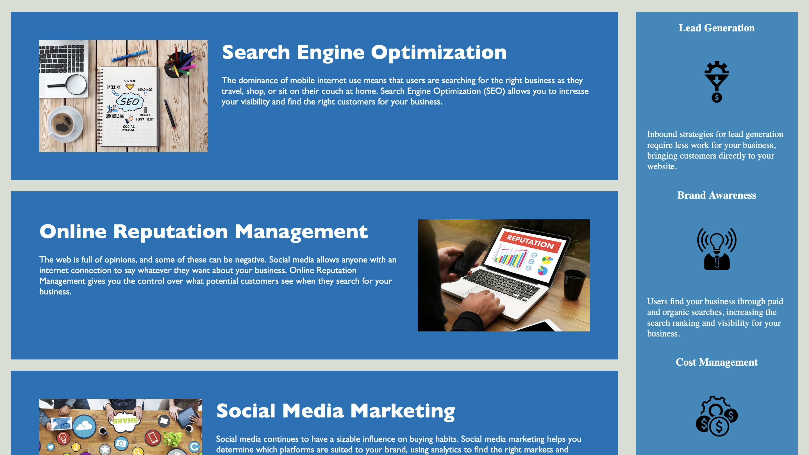
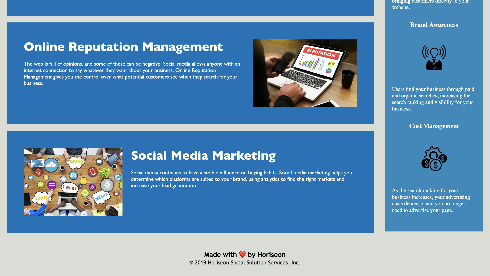

# uwbootcamp_homework1
## Assignment Overview
The goal of this assignment is to refactor a website's codebase to meet accessibility standards and follow best coding practices, while maintaing the same functinoality. 

## Modifications I Made
* Added alt text to every image to support screen readers. 
* Added comments to `style.css`
* Used the [element flowchart](http://html5doctor.com/downloads/h5d-sectioning-flowchart.pdf) to determmine which semantic tags I should use in place of the div tags.
* Combined the `benefit-cost`, `benefit-brand`, and `benefit-lead` CSS classes into a single `.benefit` class
* Combined the `h3` classes for `benefit-cost`, `benefit-brand`, and `benefit-lead` CSS classes into a single class `.benefit h3`
* Combined the `img` classes for `benefit-cost`, `benefit-brand`, and `benefit-lead` CSS classes into a single class `.benefit img`
* Combined the `search-engine-optimization`, `online-reputation-management`, and `social-media-marketing` CSS classes into a single class `.container`
* Combined the  `h2` classes for `search-engine-optimization`, `online-reputation-management`, and `social-media-marketing` CSS classes into a single class `.container h2`
* Combined the `img` classes for `search-engine-optimization`, `online-reputation-management`, and `social-media-marketing` CSS classes into a single class `.container img`
* Changed `header h1 .seo` into id `#seo` since it was only used once
* Refactored all the `.header div` classes to be `.header nav`

## [Horiseon Landing Page](https://delizoderek.github.io/uwbootcamp_homework1/)

